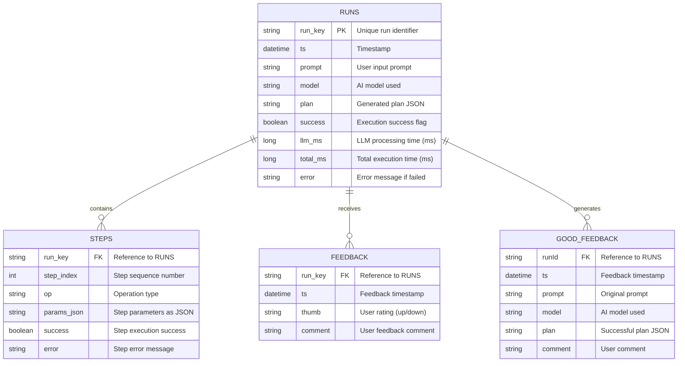

# Entity-Relationship Diagram

## SolidWorks CAD Modeling System Database Schema

## Database Collections

### 1. **RUNS** (Primary Collection)
- Stores each execution run of the CAD modeling system
- Contains the prompt, generated plan, and execution results
- Tracks performance metrics (LLM time, total time)
- Success/failure status with error messages

### 2. **STEPS** (Child of RUNS)
- Stores individual steps from each execution plan
- Each step has an operation type and parameters
- Tracks success/failure at the granular step level
- Linked to parent run via `run_key`

### 3. **FEEDBACK** (Feedback2 Collection)
- User feedback on run results
- Thumbs up/down rating system
- Optional comments for improvement
- Time-stamped for tracking feedback trends

### 4. **GOOD_FEEDBACK** (Curated Examples)
- Stores successful examples for few-shot learning
- Used to improve future AI responses
- Contains prompts and their successful plans
- Separate collection for high-quality training data

## Relationships

- **RUNS ↔ STEPS**: One-to-Many
  - Each run can have multiple execution steps
  - Steps are deleted when run is replaced

- **RUNS ↔ FEEDBACK**: One-to-Many
  - Users can provide feedback on each run
  - Feedback is preserved independently

- **RUNS ↔ GOOD_FEEDBACK**: One-to-Many (conceptual)
  - Successful runs may be promoted to good feedback
  - Used for retrieving few-shot examples

## Key Features

- **Temporal Tracking**: All entities include timestamps for chronological queries
- **Error Handling**: Comprehensive error tracking at both run and step levels
- **Performance Metrics**: Execution time tracking for optimization
- **Learning System**: Good feedback collection for continuous improvement
- **Upsert Operations**: Runs use replace with upsert to avoid duplicates
